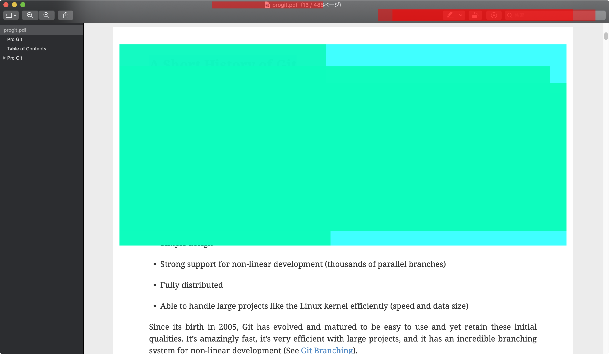

# mumemo

Mumemo is screenshot-driven note application.
Mumemo is also No-UI(User Interaction) note application.

## Features

- Screenshot **focus area** automatically and add note about it
- Support No-UI(User Interaction) mode

mumemo decide **focus area** according to followings:

- Cursor point
- Highlight ares like sections in the screenshot
    - mumemo use [OpenCV.js](https://docs.opencv.org/3.4/d5/d10/tutorial_js_root.html) 

Example of **focus area** workflow(`DEBUG:true`):

| Input  |  Step 2    |  Step 3  |  Step 4    | Output |
| ---- | ---- | ---- | ---- | ---- |
|  |      |      |      |  | 

> Screenshot from <https://git-scm.com/book/ja/v2>

## Installation

> https://github.com/azu/mumemo/releases/latest

1. Download a binary from [the latest releases](https://github.com/azu/mumemo/releases/latest)
2. Install app

:warning: This app is not signed. So, OS show warning about it.

Additional installation steps on macOS:

1. Select `mumemo.app`
2. Open context menu and Click "Open"

## Usage

### 1. Setup 

1. Setup **output directory**

This app writes Markdown note(`README.md`) and screenshots into the output directory.

### 2. Start to note via Global Shortcut

:memo: You need to allow mumemo.app to access "Accessibility" and "Screen recording" on macOS's Privacy options
This permission is needed to get active window information.

1. Press <kbd>CommandOrControl+Shift+X</kbd> (It can be customized by `mumemo.config.js`)
2. Capture **focus area** and show note window​

3. Note your memo into the window
4. Save it

The app writes the input memo and captured image into **output directory**.

## Configuration

You can customize key config and others by `~/.config/mumemo/mumemo.config.js`

- `shortcutKey`: shortcut key for launch
    - See also the key syntax: <https://www.electronjs.org/docs/api/accelerator>
- `create()`: This function create config and return it 
    - This function is called when shortcut key was pressed

```js
module.exports.shortcutKey = "CommandOrControl+Shift+M"
/**
 * app is electron app
 * path is Node's path module
 * activeWindow is https://github.com/sindresorhus/active-win result
 **/
module.exports.create = ({ app, path, activeWindow }) => {
    return {
        autoFocus: true,
        autoSave: true,
        autoSaveTimeoutMs: 5 * 1000,
        // DEBUG,
        DEBUG: false
    };
}
```

`UserConfig` inteface is following.

```ts
export type UserConfig = {
    /**
     * Enable debug mode
     * Default: false
     */
    DEBUG: boolean;
    /**
     * Output file name
     * Default: README.md
     */
    outputFileName: string;
    /**
     * format input by this function and append the result
     * Default: for markdown
     */
    outputContentTemplate: (args: OutputContentTemplateArgs) => string;
    /**
     * Auto focus when open input window
     * Default: true
     */
    autoFocus: boolean;
    /**
     * Save content automatically without no focus the input window after autoSaveTimeoutMs
     * Default: true
     */
    autoSave: boolean;
    /**
     * config for autosave
     * Default: 30 * 1000
     */
    autoSaveTimeoutMs: number;
    /**
     * bound ratio for screenshot
     * Increase actual focus area using this ratio.
     * Default: 1.2
     */
    screenshotBoundRatio: number;
    /**
     * Search count for related content that is included into screenshot result
     * The higher the number, screenshot size is large.
     * Default: 5
     */
    screenshotSearchRectangleMaxCount: number
};
```

For more details, see [src/main/Config.ts](src/main/Config.ts)

## Recipes

### No-UI notes

`mumemo` works with No-UI(User Integration).

The combination of `autoFocus: false` and `autoSave: true` that allow to save without user interaction.

1. Press shortcut
2. Preview the result in popup window
    - You can add a note if you want
3. Close the window and save it after 3 seconds

```js
module.exports.shortcutKey = "CommandOrControl+Shift+X"
module.exports.create = ({ app, path }) => {
    return {
        autoFocus: false,
        autoSave: true,
        autoSaveTimeoutMs: 3 * 1000,
    };
}
```

## Motivation

I've liked to write note and capture the screenshot during reading a book.

This behavior take two steps.

1. Capture the screenshot
2. Go to another note application like [OneNote](https://www.onenote.com/) and paste it
3. Add a note about the screenshot(page)
4. Back to viewer application

`mumemo` reduce the steps.

1. Press key -> Capture the screenshot and save it 
2. [Options] Add a note if I want


## Debug

mumemo output debug log using [electron-log](https://www.npmjs.com/package/electron-log)

    on Linux: ~/.config/{app name}/logs/{process type}.log
    on macOS: ~/Library/Logs/{app name}/{process type}.log
    on Windows: %USERPROFILE%\AppData\Roaming\{app name}\logs\{process type}.log

Tail logging

```
$ tail -F ~/Library/Logs/mumemo/main.log
```

## Contributing

1. Fork it!
2. Create your feature branch: `git checkout -b my-new-feature`
3. Commit your changes: `git commit -am 'Add some feature'`
4. Push to the branch: `git push origin my-new-feature`
5. Submit a pull request :D

## License

MIT
